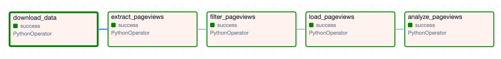
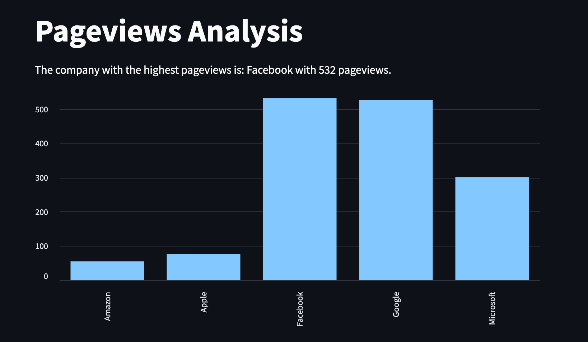
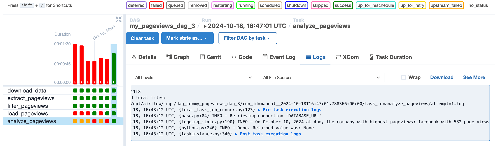

# CoreSentiment - Stock Market Prediction Tool With Applied Sentiment Analysis

## Project Description:
CoreSentiment is a stock market prediction tool developed for a data consulting organization. It leverages sentiment analysis by using Wikipedia page views as a proxy for public interest in companies. The project assumes that an increase in page views indicates a positive sentiment and correlates with a rise in stock prices, while a decrease in views suggests declining interest and potential stock price drops.

The project involves downloading hourly page view data, extracting relevant fields and page names, and loading the data into a database for analysis. The objective is to identify which company garnered the highest number of page views during the specified hour, providing insights into potential stock movements.

## Task Summary:
- Download and extract the zip file containing the pageviews data for just one hour
- Fetch the needed fields and pagenames only
- Load the fetched data into a database of your choice
- Perform a simple analysis to get the company with the highest pageviews for that hour

## Project Task:
- Create the first version of a DAG pulling the Wikipedia pageview counts by downloading, extracting, and reading the pageview data for any one hour duration on any date in October 2024 (e.g 4pm data for 10th of October, 2024).
-  Select just five companies (Amazon, Apple, Facebook, Google, and Microsoft) from the data extracted in order to initially track and validate the hypothesis.

## Project Architecture:
- The project is built using Apache Airflow, a platform to programmatically author, schedule, and monitor workflows.
- The project uses a PostgreSQL database to store the extracted data.
- The project uses Docker to run the Airflow and Database environments.
- The project uses the `wiki_pageviews_dag` DAG to download, extract, and read the pageview data for any one hour duration on any date in October 2024.

<br/>


## DAG Graph:


## Results/Executive Summary:
The company with the highest pageviews in the selected hour (October 10, 2024, at 4pm) is `Facebook` with `532 page views`.






## Project Breakdown:
1. Data Ingestion:
   - Download and extract the Wikipedia pageviews data for a selected hour on a chosen date (e.g., 10th of October, 2024 at 4pm).

2. Data Processing:
   - Filter the extracted pageviews based on five companies: Amazon, Apple, Facebook, Google, and Microsoft.
   - Filtered data is structured in a csv file
   
3. Data Storage:
   - Load the processed data into a Postgres database for further analysis.

4. Data Analysis:
   - Identify which company had the highest pageviews in the selected hour.


## How to Run the Project:
1. Install the required dependencies by running the following command:
   ```bash
   pip install -r requirements.txt
   ```
2. Setup the Airflow and Database environments using docker by running the following command:
   ```bash
      docker-compose up -d
   ```
3. Access the Airflow UI by visiting `http://localhost:8080/` in your browser.
4. Turn on the `pageviews_dag` DAG.
5. Trigger the DAG by clicking on the `Trigger DAG` button.
6. Check the logs and the database to see the results.
7. To view using Streamlit, change into the dags `cd dags`, and run the following command:
   ```bash
   streamlit run streamlit.py
   ```

   or if you have `make` installed:
   
   ```bash
   make streamlit
   ```
8. To stop the Airflow and Database environments:
   ```bash
   docker-compose down
   ```

**Note:** The project has CI/CD setup using GitHub Actions. The CI/CD pipeline runs the tests and checks the code quality on every PR to the main branch.

## Recommendations:
1. Add a time range to the DAG to fetch data for multiple hours.